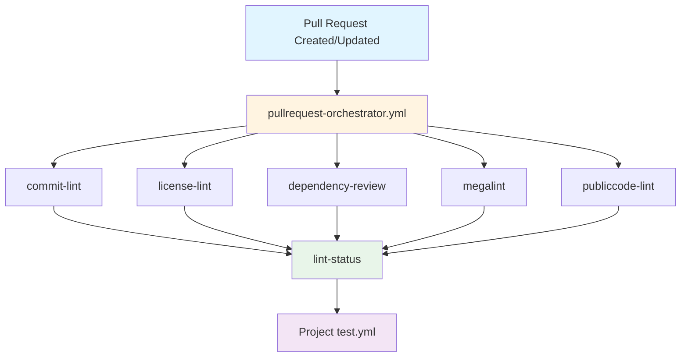
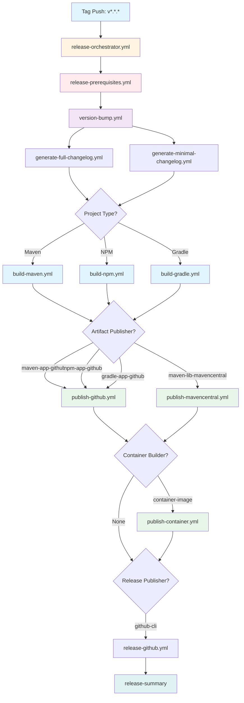
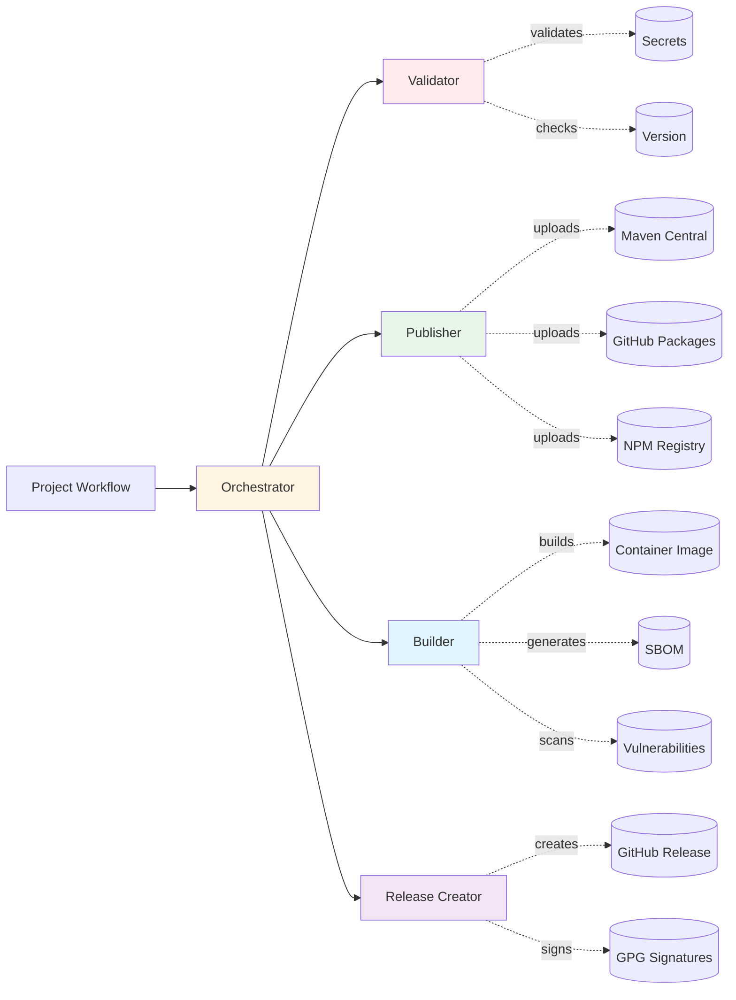
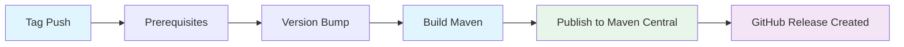
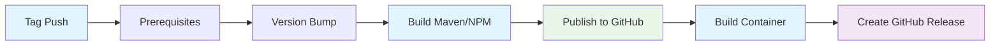
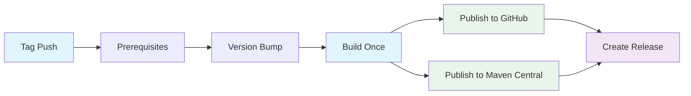

<!--
SPDX-FileCopyrightText: 2025 The Reusable CI Authors

SPDX-License-Identifier: CC0-1.0
-->

# Workflow Architecture and Patterns

Advanced workflow documentation for DiggSweden reusable CI/CD workflows.

For basic usage, configuration, and getting started, see [README.md](../README.md).

## Table of Contents

- [Workflow Architecture](#workflow-architecture)
- [Project Structure Required](#project-structure-required)
- [Examples](#examples)

---

## Workflow Architecture

### Pull Request Workflow Architecture



### Release Workflow Architecture (v2-dev with Containers)



### Component Interaction Flow



### Workflow Execution Patterns (v2-dev)

#### Pattern 1: Maven Library (cose-lib)



#### Pattern 2: Maven/NPM Application with Container (issuer-poc, linter)



#### Pattern 3: Multi-Registry Publishing



---

## Project Structure Required

### Maven Projects

```text
your-repo/
├── pom.xml
├── src/
├── Containerfile (optional)
└── .github/
    └── workflows/
        ├── pullrequest-workflow.yml
        └── release-workflow.yml
```

### NPM Projects

```text
your-repo/
├── package.json
├── package-lock.json
├── src/
├── Containerfile (optional)
└── .github/
    └── workflows/
        ├── pullrequest-workflow.yml
        └── release-workflow.yml
```

### Gradle Projects (Android/JVM)

```text
your-repo/
├── build.gradle.kts
├── settings.gradle.kts
├── gradle.properties              # Version management (versionName, versionCode)
├── CHANGELOG.md
├── app/
│   └── build.gradle.kts
├── gradlew
└── .github/
    └── workflows/
        ├── pullrequest-workflow.yml
        ├── release-workflow.yml
        └── test.yml (optional)
```

**Important:** For Gradle projects, version information must be stored in `gradle.properties`:

```properties
versionName=1.0.0
versionCode=5
```

And read in `app/build.gradle.kts`:

```kotlin
android {
    defaultConfig {
        versionCode = (project.property("versionCode") as String).toInt()
        versionName = project.property("versionName") as String
    }
}
```

---

## Examples

### Java Spring Boot Application

```yaml
# .github/artifacts.yml
artifacts:
  - name: my-app
    project-type: maven
    working-directory: .
    publishers:
      - maven-app-github
    config:
      javaversion: 21

containers:
  - name: my-app
    from: [my-app]
    containerfile: Containerfile
    context: .
    platforms: linux/amd64,linux/arm64

# .github/workflows/release-workflow.yml
jobs:
  release:
    uses: diggsweden/reusable-ci/.github/workflows/release-orchestrator.yml@v2-dev
    with:
      artifacts-config: .github/artifacts.yml
      release-publisher: github-cli
```

### Node.js API Service

```yaml
# .github/artifacts.yml
artifacts:
  - name: api-service
    project-type: npm
    working-directory: .
    publishers:
      - npm-app-github
    config:
      nodeversion: 22

containers:
  - name: api-service
    from: [api-service]
    containerfile: Containerfile
    context: .
    platforms: linux/amd64,linux/arm64

# .github/workflows/release-workflow.yml
jobs:
  release:
    uses: diggsweden/reusable-ci/.github/workflows/release-orchestrator.yml@v2-dev
    with:
      artifacts-config: .github/artifacts.yml
      release-publisher: github-cli
```

### Maven Library (No Container)

```yaml
# .github/artifacts.yml
artifacts:
  - name: my-lib
    project-type: maven
    working-directory: .
    publishers:
      - maven-lib-mavencentral
    config:
      javaversion: 21
      settingspath: .mvn/settings.xml

# No containers section needed

# .github/workflows/release-workflow.yml
jobs:
  release:
    uses: diggsweden/reusable-ci/.github/workflows/release-orchestrator.yml@v2-dev
    with:
      artifacts-config: .github/artifacts.yml
      release-publisher: github-cli
```

### Android Application (Gradle)

```yaml
# .github/artifacts.yml
artifacts:
  - name: my-android-app
    project-type: gradle
    working-directory: .
    publishers:
      - gradle-app-github
    config:
      javaversion: 21
      gradletasks: build assembleDemoRelease bundleDemoRelease
      buildmodule: app
      attachpattern: app/build/outputs/**/*.{apk,aab}
      gradleversionfile: gradle.properties

# .github/workflows/release-workflow.yml
jobs:
  release:
    uses: diggsweden/reusable-ci/.github/workflows/release-orchestrator.yml@v2-dev
    permissions:
      contents: write
      packages: write
      id-token: write
    with:
      artifacts-config: .github/artifacts.yml
      release-publisher: github-cli
      changelog-creator: git-cliff
      release.signartifacts: true
      release.generatesbom: true
```

**What this produces:**

- APK (release) → `app/build/outputs/apk/demo/release/*.apk`
- AAB (bundle) → `app/build/outputs/bundle/demoRelease/*.aab`
- SBOM → `sbom.cyclonedx.json`
- All attached to GitHub Release

### JVM Application (Gradle, non-Android)

```yaml
# .github/artifacts.yml
artifacts:
  - name: spring-boot-app
    project-type: gradle
    working-directory: .
    publishers:
      - gradle-app-github
    config:
      javaversion: 21
      gradletasks: build bootJar

containers:
  - name: spring-boot-app
    from: [spring-boot-app]
    containerfile: Containerfile
    context: .
    platforms: linux/amd64,linux/arm64

# .github/workflows/release-workflow.yml
jobs:
  release:
    uses: diggsweden/reusable-ci/.github/workflows/release-orchestrator.yml@v2-dev
    with:
      artifacts-config: .github/artifacts.yml
      release-publisher: github-cli
```

### Development Builds

```yaml
on:
  push:
    branches: [develop]
jobs:
  build:
    uses: diggsweden/.github/.github/workflows/release-dev-orchestrator.yml@main
    with:
      project-type: maven  # Only builds container, no releases/artifacts
```

---

*Last updated: 2025-10-08*
