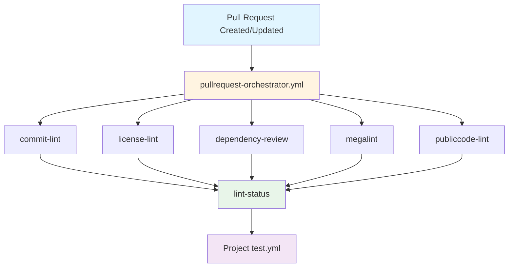
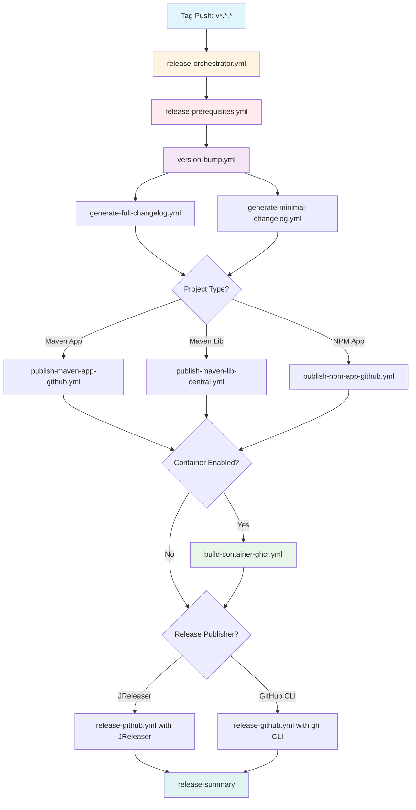
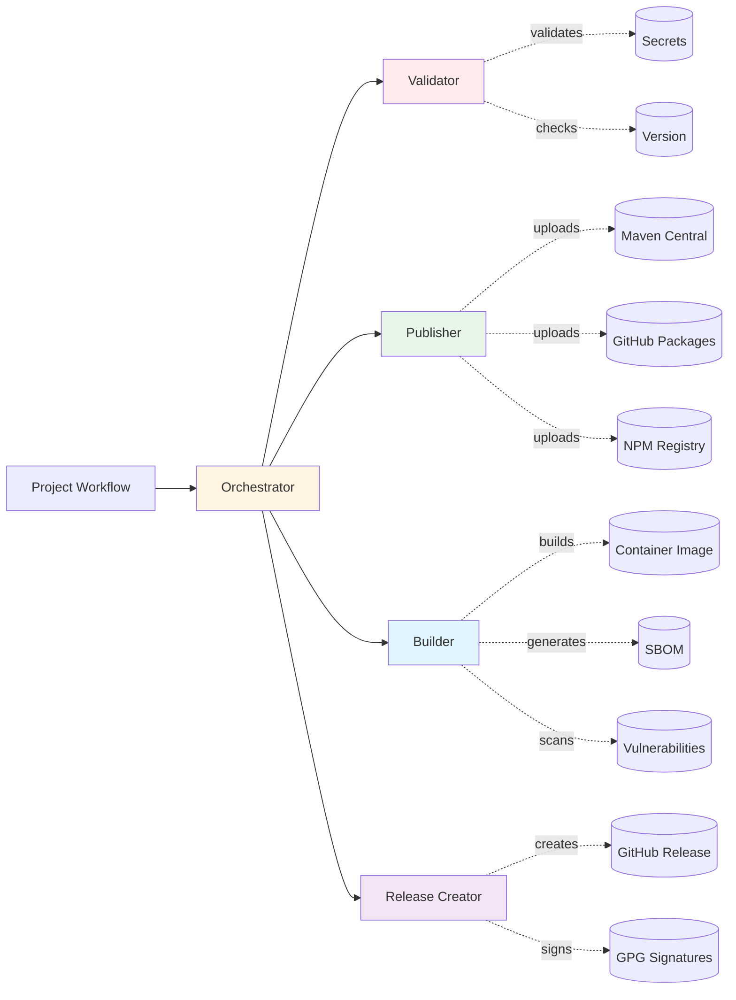
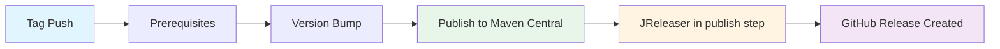
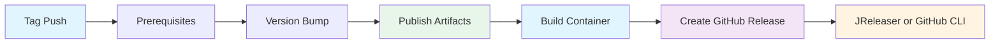

# Workflow Architecture and Patterns

Advanced workflow documentation for DiggSweden reusable CI/CD workflows.

For basic usage, configuration, and getting started, see [README.md](../README.md).

## Table of Contents
- [Workflow Architecture](#workflow-architecture)
- [JReleaser Integration Patterns](#jreleaser-integration-patterns)
- [Project Structure Required](#project-structure-required)
- [Examples](#examples)

---

## Workflow Architecture

### Pull Request Workflow Architecture



### Release Workflow Architecture



### Component Interaction Flow



### Workflow Execution Patterns

#### Pattern 1: Maven Library (cose-lib)


#### Pattern 2: Maven/NPM Application with Container (issuer-poc, linter)


---

## JReleaser Integration Patterns

JReleaser is used differently depending on your project type. Understanding when and how JReleaser runs is critical for correct configuration.

### Pattern 1: Library Publishing (Maven Central)

**Used by:** Maven libraries published to Maven Central (e.g., `cose-lib`)

**How it works:**
```yaml
# release-workflow.yml
with:
  artifactPublisher: maven-lib-mavencentral
  artifact.jreleaserenabled: true
  # No releasePublisher configured
```

**JReleaser runs DURING the Maven publish step:**
```text
1. Version bump
2. Publish to Maven Central
   └─ mvn deploy (publishes to Central)
   └─ mvn jreleaser:full-release (creates GitHub release)
3. Done (no separate release step)
```

**Why this pattern:**
- Libraries typically only publish JARs (no containers)
- JReleaser is configured as a Maven plugin in `pom.xml`
- GitHub release creation happens as part of publishing
- Single-step deployment to both Central and GitHub

**Configuration required:**
```xml
<!-- In pom.xml -->
<plugin>
  <groupId>org.jreleaser</groupId>
  <artifactId>jreleaser-maven-plugin</artifactId>
  <version>${jreleaser-maven-plugin.version}</version>
  <configuration>
    <configFile>${project.basedir}/jreleaser.yml</configFile>
  </configuration>
</plugin>
```

**Example repositories:**
- `cose-lib` - See `.github/workflows/release-workflow.yml`

---

### Pattern 2: Application Publishing (with Container Images)

**Used by:** Applications that build both artifacts AND containers (e.g., `eudiw-wallet-issuer-poc`, `rest-api-profil-lint-processor`)

**How it works:**
```yaml
# release-workflow.yml
with:
  artifactPublisher: maven-app-github  # or npm-app-github
  containerBuilder: containerimage-ghcr
  releasePublisher: jreleaser  # or github-cli
```

**JReleaser runs AFTER all artifacts are ready:**
```text
1. Version bump
2. Publish artifacts (JAR or NPM)
3. Build container image
4. Create GitHub release
   └─ JReleaser or GitHub CLI creates release
   └─ Attaches JAR + container reference + SBOM
```

**Why this pattern:**
- Applications need both artifacts AND containers
- Container must be built before creating release
- Release notes need to reference container image
- GitHub release is created after ALL artifacts ready

**When to use JReleaser vs GitHub CLI:**
- **JReleaser:** Maven projects with complex artifact sets
- **GitHub CLI:** NPM projects or simpler releases

**Example repositories:**
- `eudiw-wallet-issuer-poc` - Maven app with JReleaser
- `rest-api-profil-lint-processor` - NPM app with GitHub CLI

---

### Decision Tree: Which Pattern Should I Use?

```text
Is this a library or application?
├─ Library
│  └─ Publishing to Maven Central?
│     ├─ Yes → Use Pattern 1 (JReleaser in publish step)
│     └─ No → Use Pattern 2 (separate release step)
│
└─ Application
   └─ Building container images?
      ├─ Yes → Use Pattern 2 (JReleaser after container)
      └─ No → Either pattern works (Pattern 2 recommended)
```

### Common Mistakes

**❌ Wrong: Using Pattern 1 for applications with containers**
```yaml
# This doesn't work if you build containers!
artifactPublisher: maven-app-github
artifact.jreleaserenabled: true  # ← JReleaser runs too early
containerBuilder: containerimage-ghcr  # ← Container built AFTER release created
```

**Problem:** GitHub release is created before container exists, so container can't be referenced in release notes.

**✅ Correct: Using Pattern 2 for applications with containers**
```yaml
artifactPublisher: maven-app-github
containerBuilder: containerimage-ghcr
releasePublisher: jreleaser  # ← JReleaser runs AFTER container ready
```

---

## Project Structure Required

### Maven Projects
```text
your-repo/
├── pom.xml
├── src/
├── Containerfile (optional)
├── jreleaser.yml (optional)
└── .github/
    └── workflows/
        ├── pullrequest-workflow.yml
        └── release-workflow.yml
```

### NPM Projects
```text
your-repo/
├── package.json
├── package-lock.json
├── src/
├── Containerfile (optional)
└── .github/
    └── workflows/
        ├── pullrequest-workflow.yml
        └── release-workflow.yml
```

---

## Examples

### Java Spring Boot Application
```yaml
jobs:
  release:
    uses: diggsweden/.github/.github/workflows/release-orchestrator.yml@main
    with:
      projectType: maven
      artifactPublisher: maven-app-github      # JAR to GitHub Packages
      containerBuilder: containerimage-ghcr    # Docker image to ghcr.io
      releasePublisher: jreleaser              # GitHub release with changelog
      artifact.javaversion: "21"               # Java 21 LTS
      container.platforms: "linux/amd64,linux/arm64"  # Intel + ARM support
```

### Node.js API Service
```yaml
jobs:
  release:
    uses: diggsweden/.github/.github/workflows/release-orchestrator.yml@main
    with:
      projectType: npm
      artifactPublisher: npm-app-github     # Package to GitHub NPM registry
      containerBuilder: containerimage-ghcr # Docker image with Node.js app
      releasePublisher: github-cli          # GitHub CLI for releases
      artifact.nodeversion: "22"            # Latest Node.js LTS
```

### Maven Library (No Container)
```yaml
jobs:
  release:
    uses: diggsweden/.github/.github/workflows/release-orchestrator.yml@main
    with:
      projectType: maven
      artifactPublisher: maven-lib-mavencentral  # Publish to Maven Central
      releasePublisher: jreleaser                # Handles Central deployment
      artifact.settingspath: ".mvn/settings.xml" # Contains Central credentials
      artifact.jreleaserenabled: true            # JReleaser plugin in pom.xml
```

### Development Builds
```yaml
on:
  push:
    branches: [develop]
jobs:
  build:
    uses: diggsweden/.github/.github/workflows/release-dev-orchestrator.yml@main
    with:
      projectType: maven  # Only builds container, no releases/artifacts
```

---

*Last updated: 2024*
