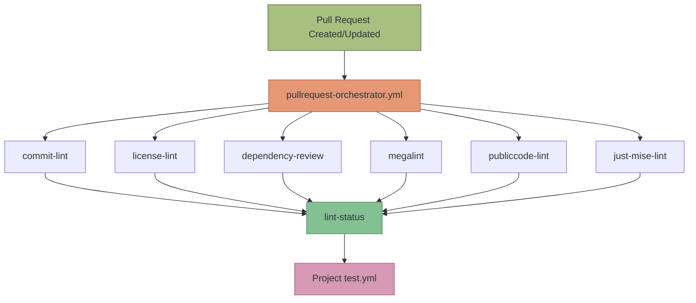
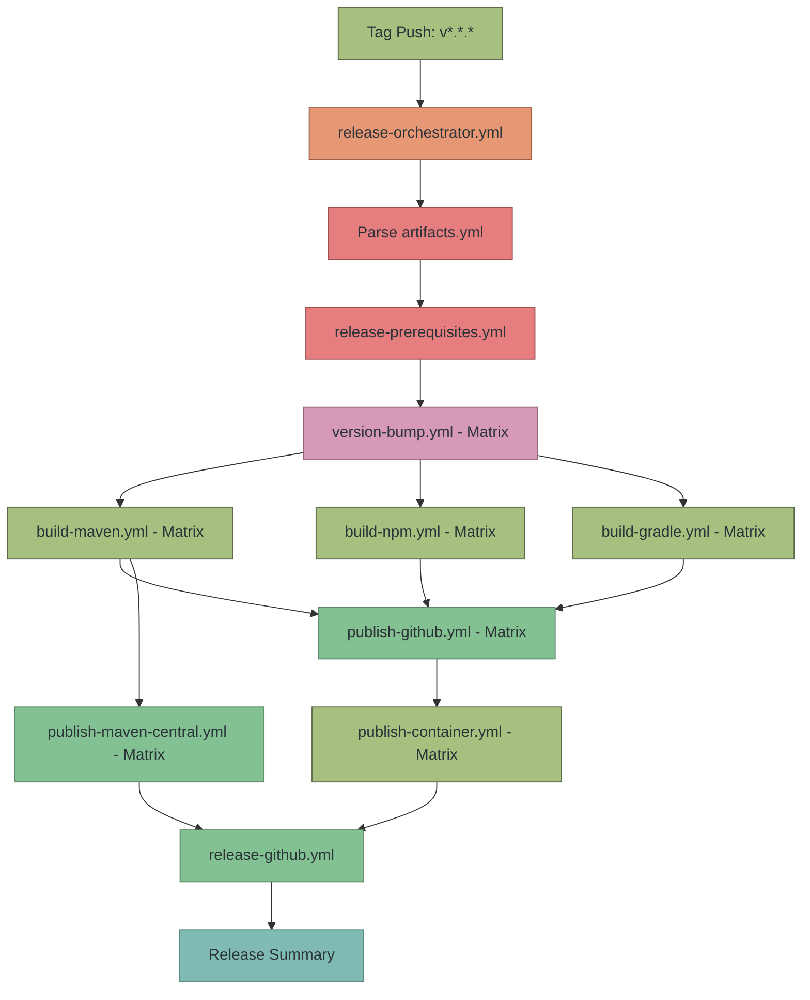
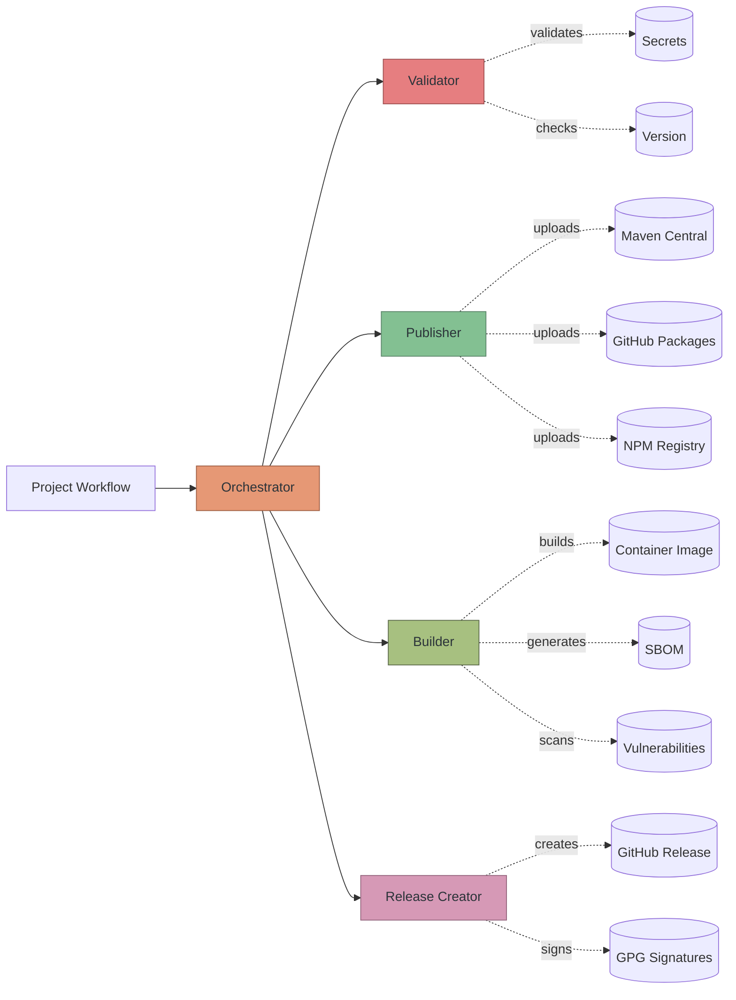
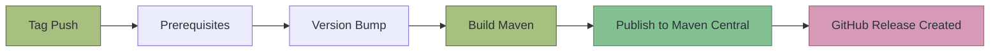
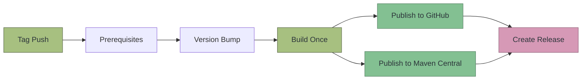

<!--
SPDX-FileCopyrightText: 2025 The Reusable CI Authors

SPDX-License-Identifier: CC0-1.0
-->

# Workflow Architecture and Patterns

## Pull Request Workflow Architecture

### Release Workflow Architecture

### Component Interaction Flow

### Workflow Execution Patterns

#### Pattern 1: Maven Library

#### Pattern 2: Maven/NPM Application with Container

```mermaid
graph LR
    A[Tag Push] --> B[Prerequisites]
    B --> C[Version Bump]
    C --> D[Build Maven/NPM]
    D --> E[Publish to GitHub]
    E --> F[Build Container]
    F --> G[Create GitHub Release]

    style A fill:#a7c080,stroke:#5c6a4a,color:#2b3339
    style D fill:#a7c080,stroke:#5c6a4a,color:#2b3339
    style E fill:#83c092,stroke:#5c856a,color:#2b3339
    style F fill:#a7c080,stroke:#5c6a4a,color:#2b3339
    style G fill:#d699b6,stroke:#93647c,color:#2b3339
```

#### Pattern 3: Multi-Registry Publishing

---
