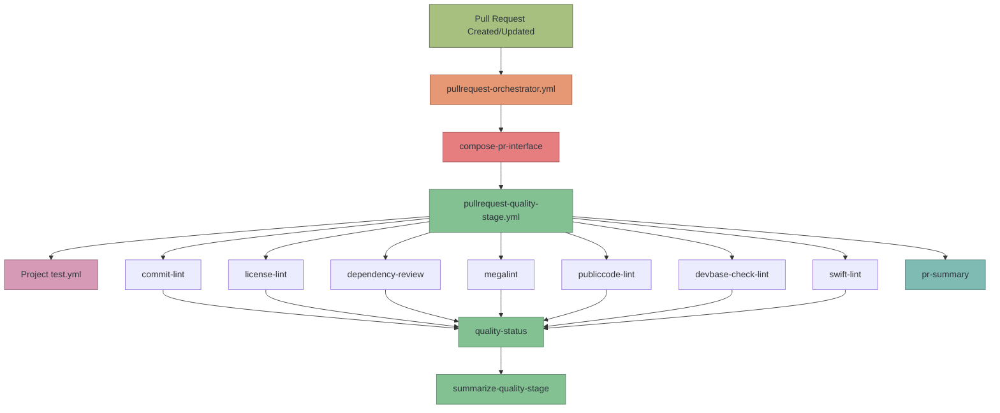
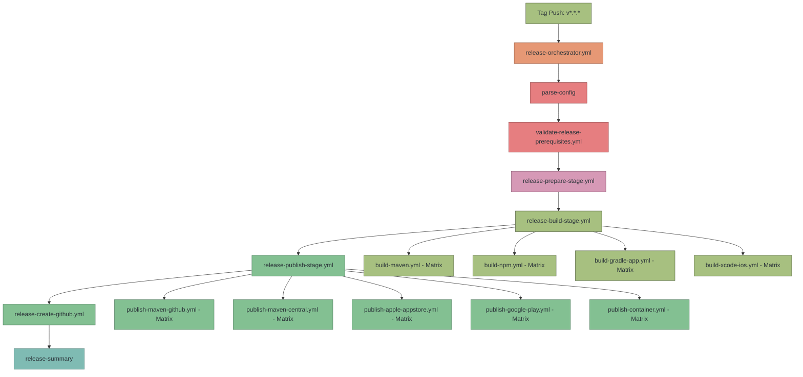
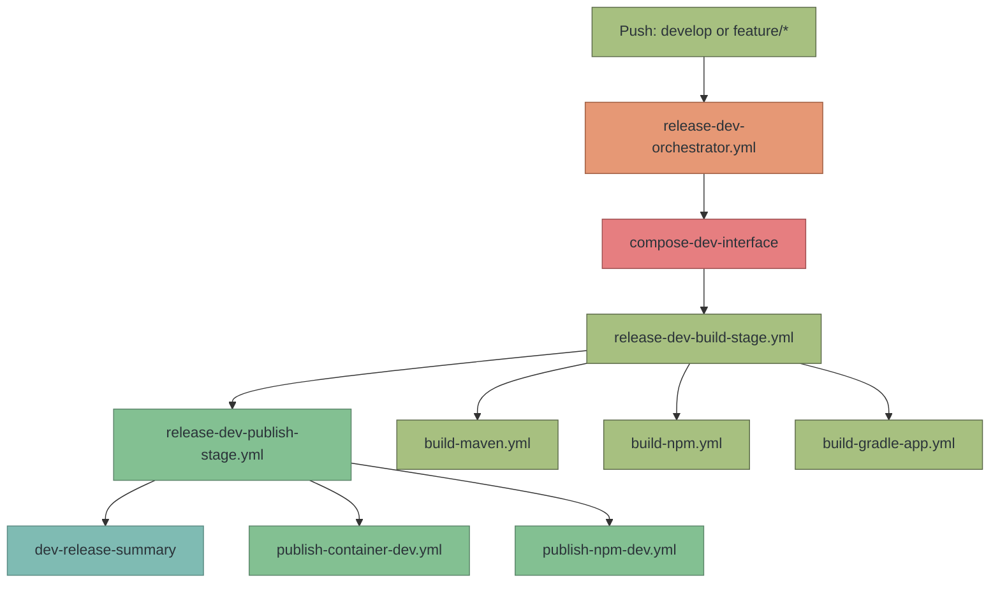
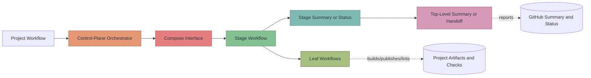

<!--
SPDX-FileCopyrightText: 2025 Digg - Agency for Digital Government

SPDX-License-Identifier: CC0-1.0
-->

# Workflow Architecture and Patterns

For workflow design rules and the planned long-term structure, see `docs/workflow-design-policy.md`.

## Pull Request Workflow Architecture

Primary high-level entry point: `pullrequest-orchestrator.yml`

The pull request flow follows the same control-plane pattern as release and dev:

1. `compose-pr-interface`
2. `execute-quality-stage`
3. `pr-summary`

The PR interface payloads carry project/base-branch context plus enabled quality-policy flags.
The quality stage owns lint/security fanout and produces one stage result contract.
The top-level summary job consumes the quality stage result and writes a GitHub Step Summary.


```mermaid
graph TD
    A[Pull Request Created/Updated] --> B[pullrequest-orchestrator.yml]
    B --> C[compose-pr-interface]
    C --> D[pullrequest-quality-stage.yml]
    D --> E[Project test.yml]

    D --> F[commit-lint]
    D --> G[license-lint]
    D --> H[dependency-review]
    D --> I[megalint]
    D --> J[publiccode-lint]
    D --> K[devbase-check-lint]
    D --> L[swift-lint]
    F --> M[quality-status]
    G --> M
    H --> M
    I --> M
    J --> M
    K --> M
    L --> M
    M --> N[summarize-quality-stage]
    D --> O[pr-summary]

    style A fill:#a7c080,stroke:#5c6a4a,color:#2b3339
    style B fill:#e69875,stroke:#9d5c41,color:#2b3339
    style C fill:#e67e80,stroke:#9d4f50,color:#2b3339
    style D fill:#83c092,stroke:#5c856a,color:#2b3339
    style E fill:#d699b6,stroke:#93647c,color:#2b3339
    style M fill:#83c092,stroke:#5c856a,color:#2b3339
    style N fill:#83c092,stroke:#5c856a,color:#2b3339
    style O fill:#7fbbb3,stroke:#5a8a82,color:#2b3339
```

### PR Stage Responsibilities

- `pullrequest-orchestrator.yml` owns PR order, policy handoff, and top-level summary
- `pullrequest-quality-stage.yml` owns quality check fanout and quality-stage result normalization
- leaf `lint-*` and `security-*` workflows stay focused on one check each

### PR Interface Contract

The PR orchestrator produces two JSON payloads that drive the quality stage:

**`pr-context-json`** — runtime context:

| Field | Source | Purpose |
|-------|--------|---------|
| `project_type` | `inputs.project-type` | Project ecosystem (maven, npm, python) |
| `base_branch` | `inputs.base-branch` or PR target | Base branch for commit linting |
| `reusable_ci_ref` | `github.workflow_sha` | Reusable workflow revision used for helper script checkout |

**`pr-policy-json`** — quality check toggles:

| Field | Default | Purpose |
|-------|---------|---------|
| `commitlint` | `true` | Enable commit message linting (deprecated v3.0) |
| `licenselint` | `true` | Enable SPDX license header linting (deprecated v3.0) |
| `dependencyreview` | `true` | Enable dependency vulnerability review |
| `megalint` | `true` | Enable MegaLinter (deprecated v3.0) |
| `publiccodelint` | `false` | Enable publiccode.yml linting |
| `devbasecheck` | `false` | Enable devbase-check (recommended, replaces deprecated linters) |
| `swiftformat` | `false` | Enable swift-format for iOS/macOS |
| `swiftlint` | `false` | Enable SwiftLint for iOS/macOS |
| `swift` | derived | `true` if either swiftformat or swiftlint is enabled |

### PR Quality Stage Result Contract

The quality stage produces a normalized result payload (`result-json`):

```json
{
  "stage": "pr-quality",
  "result": "success|failure|cancelled",
  "ran": true,
  "targets": {
    "commitlint": "success|failure|cancelled|skipped",
    "licenselint": "success|failure|cancelled|skipped",
    "dependencyreview": "success|failure|cancelled|skipped",
    "megalint": "success|failure|cancelled|skipped",
    "publiccodelint": "success|failure|cancelled|skipped",
    "devbasecheck": "success|failure|cancelled|skipped",
    "swift": "success|failure|cancelled|skipped"
  }
}
```

Each target is `"skipped"` if the corresponding policy flag is `false`.
The stage `result` is `"failure"` if any target failed, `"cancelled"` if any was cancelled (and none failed), otherwise `"success"`.

### Release Workflow Architecture

Primary high-level entry point: `release-orchestrator.yml`

The workflows shown underneath are mostly helper workflows used by the orchestrator, but several can still be used directly by advanced consumers when finer control is needed.

The current production release flow is intentionally stage-based:

1. `parse-config`
2. `validate-prerequisites`
3. `execute-prepare-stage`
4. `execute-build-stage`
5. `execute-publish-stage`
6. `create-release`
7. `release-summary`

The public orchestrator now acts as the release control plane. Build and publish fanout live one layer lower in stage-level reusable workflows.
Release preparation now follows the same pattern through `release-prepare-stage.yml`.


```mermaid
graph TD
    A[Tag Push: v*.*.* ] --> B[release-orchestrator.yml]
    B --> C[parse-config]
    C --> D[validate-release-prerequisites.yml]
    D --> E[release-prepare-stage.yml]
    E --> F[release-build-stage.yml]
    F --> G[release-publish-stage.yml]
    G --> H[release-create-github.yml]
    H --> I[release-summary]

    F --> J[build-maven.yml - Matrix]
    F --> K[build-npm.yml - Matrix]
    F --> L[build-gradle-app.yml - Matrix]
    F --> M[build-xcode-ios.yml - Matrix]

    G --> N[publish-maven-github.yml - Matrix]
    G --> O[publish-maven-central.yml - Matrix]
    G --> P[publish-apple-appstore.yml - Matrix]
    G --> Q[publish-google-play.yml - Matrix]
    G --> R[publish-container.yml - Matrix]

    style A fill:#a7c080,stroke:#5c6a4a,color:#2b3339
    style B fill:#e69875,stroke:#9d5c41,color:#2b3339
    style C fill:#e67e80,stroke:#9d4f50,color:#2b3339
    style D fill:#e67e80,stroke:#9d4f50,color:#2b3339
    style E fill:#d699b6,stroke:#93647c,color:#2b3339
    style F fill:#a7c080,stroke:#5c6a4a,color:#2b3339
    style G fill:#83c092,stroke:#5c856a,color:#2b3339
    style H fill:#83c092,stroke:#5c856a,color:#2b3339
    style I fill:#7fbbb3,stroke:#5a8a82,color:#2b3339
    style J fill:#a7c080,stroke:#5c6a4a,color:#2b3339
    style K fill:#a7c080,stroke:#5c6a4a,color:#2b3339
    style L fill:#a7c080,stroke:#5c6a4a,color:#2b3339
    style M fill:#a7c080,stroke:#5c6a4a,color:#2b3339
    style N fill:#83c092,stroke:#5c856a,color:#2b3339
    style O fill:#83c092,stroke:#5c856a,color:#2b3339
    style P fill:#83c092,stroke:#5c856a,color:#2b3339
    style Q fill:#83c092,stroke:#5c856a,color:#2b3339
    style R fill:#83c092,stroke:#5c856a,color:#2b3339
```

### Release Stage Responsibilities

- `release-orchestrator.yml` owns release order, policy handoff, and top-level stage readability
- `release-prepare-stage.yml` owns version-bump fanout and prepare-stage result normalization
- `release-build-stage.yml` owns build fanout and build-stage result normalization
- `release-publish-stage.yml` owns publish fanout and publish-stage result normalization
- leaf `build-*` and `publish-*` workflows stay focused on one ecosystem or destination each

### Dev Release Workflow Architecture

Primary high-level entry point: `release-dev-orchestrator.yml`

The dev release flow now follows the same lighter control-plane pattern:

1. `compose-dev-interface`
2. `execute-dev-build-stage`
3. `execute-dev-publish-stage`
4. `dev-release-summary`

Unlike the production flow, the dev path intentionally skips release creation, signing, SBOM generation, and the broader prerequisite/policy layer.
It still benefits from one small control-plane interface job so later stage calls depend on compact dev context, runtime metadata, and policy payloads.
The dev publish stage also exposes a compact artifact payload so the top-level workflow does not need to wire separate container and NPM leaf outputs directly.


```mermaid
graph TD
    A[Push: develop or feature/*] --> B[release-dev-orchestrator.yml]
    B --> C[compose-dev-interface]
    C --> D[release-dev-build-stage.yml]
    D --> E[release-dev-publish-stage.yml]
    E --> F[dev-release-summary]

    D --> G[build-maven.yml]
    D --> H[build-npm.yml]
    D --> I[build-gradle-app.yml]

    E --> J[publish-container-dev.yml]
    E --> K[publish-npm-dev.yml]

    style A fill:#a7c080,stroke:#5c6a4a,color:#2b3339
    style B fill:#e69875,stroke:#9d5c41,color:#2b3339
    style C fill:#e67e80,stroke:#9d4f50,color:#2b3339
    style D fill:#a7c080,stroke:#5c6a4a,color:#2b3339
    style E fill:#83c092,stroke:#5c856a,color:#2b3339
    style F fill:#7fbbb3,stroke:#5a8a82,color:#2b3339
    style G fill:#a7c080,stroke:#5c6a4a,color:#2b3339
    style H fill:#a7c080,stroke:#5c6a4a,color:#2b3339
    style I fill:#a7c080,stroke:#5c6a4a,color:#2b3339
    style J fill:#83c092,stroke:#5c856a,color:#2b3339
    style K fill:#83c092,stroke:#5c856a,color:#2b3339
```

### Component Interaction Flow


```mermaid
graph LR
    A[Project Workflow] --> B[Control-Plane Orchestrator]
    B --> C[Compose Interface]
    C --> D[Stage Workflow]
    D --> E[Leaf Workflows]
    D --> F[Stage Summary or Status]
    F --> G[Top-Level Summary or Handoff]

    E -.builds/publishes/lints.-> H[(Project Artifacts and Checks)]
    G -.reports.-> I[(GitHub Summary and Status)]

    style B fill:#e69875,stroke:#9d5c41,color:#2b3339
    style C fill:#e67e80,stroke:#9d4f50,color:#2b3339
    style D fill:#83c092,stroke:#5c856a,color:#2b3339
    style E fill:#a7c080,stroke:#5c6a4a,color:#2b3339
    style F fill:#7fbbb3,stroke:#5a8a82,color:#2b3339
    style G fill:#d699b6,stroke:#93647c,color:#2b3339
```

### Workflow Execution Patterns

#### Pattern 1: Maven Library


```mermaid
graph LR
    A[Tag Push] --> B[parse-config]
    B --> C[validate-prerequisites]
    C --> D[execute-prepare-stage]
    D --> E[execute-build-stage]
    E --> F[execute-publish-stage]
    F --> G[create-release]

    style A fill:#a7c080,stroke:#5c6a4a,color:#2b3339
    style B fill:#e67e80,stroke:#9d4f50,color:#2b3339
    style C fill:#e67e80,stroke:#9d4f50,color:#2b3339
    style D fill:#d699b6,stroke:#93647c,color:#2b3339
    style E fill:#a7c080,stroke:#5c6a4a,color:#2b3339
    style F fill:#83c092,stroke:#5c856a,color:#2b3339
    style G fill:#d699b6,stroke:#93647c,color:#2b3339
```

#### Pattern 2: Maven/NPM Application with Container


```mermaid
graph LR
    A[Tag Push] --> B[parse-config]
    B --> C[validate-prerequisites]
    C --> D[execute-prepare-stage]
    D --> E[execute-build-stage]
    E --> F[execute-publish-stage]
    F --> G[create-release]

    style A fill:#a7c080,stroke:#5c6a4a,color:#2b3339
    style B fill:#e67e80,stroke:#9d4f50,color:#2b3339
    style C fill:#e67e80,stroke:#9d4f50,color:#2b3339
    style D fill:#d699b6,stroke:#93647c,color:#2b3339
    style E fill:#a7c080,stroke:#5c6a4a,color:#2b3339
    style F fill:#83c092,stroke:#5c856a,color:#2b3339
    style G fill:#d699b6,stroke:#93647c,color:#2b3339
```

#### Pattern 3: Multi-Registry Publishing


```mermaid
graph LR
    A[Tag Push] --> B[parse-config]
    B --> C[validate-prerequisites]
    C --> D[execute-prepare-stage]
    D --> E[execute-build-stage]
    E --> F[execute-publish-stage]
    F --> G[create-release]

    style A fill:#a7c080,stroke:#5c6a4a,color:#2b3339
    style B fill:#e67e80,stroke:#9d4f50,color:#2b3339
    style C fill:#e67e80,stroke:#9d4f50,color:#2b3339
    style D fill:#d699b6,stroke:#93647c,color:#2b3339
    style E fill:#a7c080,stroke:#5c6a4a,color:#2b3339
    style F fill:#83c092,stroke:#5c856a,color:#2b3339
    style G fill:#d699b6,stroke:#93647c,color:#2b3339
```

---
