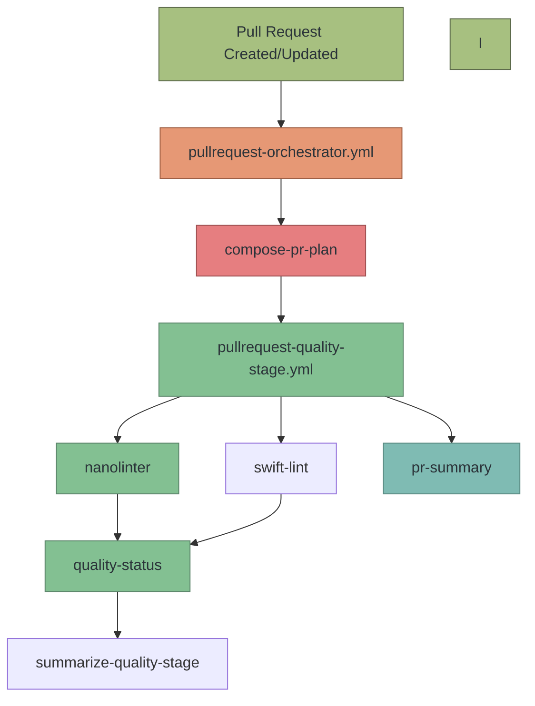
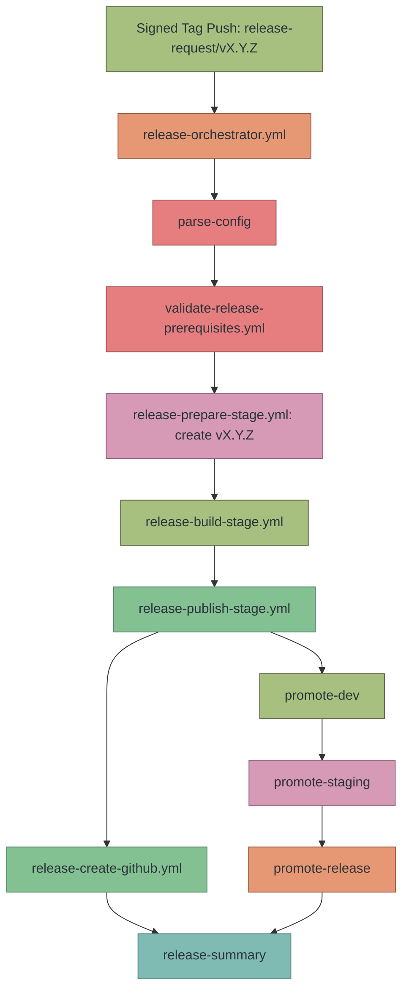
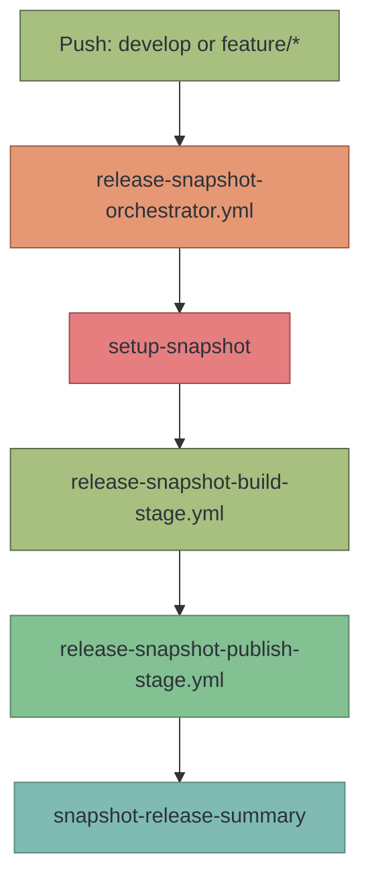
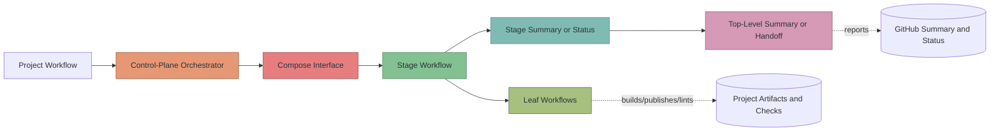

# Workflow Architecture and Patterns

For workflow design rules, see [Workflow Design Policy](workflow-design-policy.md).
For the authoritative workflow inventory and direct-call contracts, see
[Components Reference](components.md).

## Pull Request Workflow Architecture

Primary high-level entry point: `pullrequest-orchestrator.yml`

The pull request flow follows the same control-plane pattern as release and snapshot:

1. `compose-pr-plan`
2. `execute-quality-stage`
3. `pr-summary`

The PR plan carries project/base-branch context, quality-policy flags, and the quality-stage target plan.
The quality stage owns lint/security fanout and produces one stage result contract.
The top-level summary job consumes the quality stage result and writes a GitHub Step Summary.


```mermaid
graph TD
    A[Pull Request Created/Updated] --> B[pullrequest-orchestrator.yml]
    B --> C[compose-pr-plan]
    C --> D[pullrequest-quality-stage.yml]

    D --> N[nanolinter]
    D --> L[swift-lint]
    N --> M[quality-status]
    L --> M
    M --> S[summarize-quality-stage]
    D --> O[pr-summary]

    style A fill:#a7c080,stroke:#5c6a4a,color:#2b3339
    style B fill:#e69875,stroke:#9d5c41,color:#2b3339
    style C fill:#e67e80,stroke:#9d4f50,color:#2b3339
    style D fill:#83c092,stroke:#5c856a,color:#2b3339
    style I fill:#a7c080,stroke:#5c6a4a,color:#2b3339
    style M fill:#83c092,stroke:#5c856a,color:#2b3339
    style N fill:#83c092,stroke:#5c856a,color:#2b3339
    style O fill:#7fbbb3,stroke:#5a8a82,color:#2b3339
```

### PR Stage Responsibilities

- `pullrequest-orchestrator.yml` owns PR order, plan handoff, and top-level summary
- `pullrequest-quality-stage.yml` owns quality check fanout and quality-stage result normalization
- leaf `lint-*` and `security-*` workflows stay focused on one check each

### PR Plan Contract

The PR orchestrator produces typed JSON payloads that drive the quality stage:

**`pr-plan-json`**: runtime context, policy, and stage plans:

| Field | Source | Purpose |
|-------|--------|---------|
| `context.project_type` | `inputs.project-type` | Project ecosystem (`maven`, `npm`, `gradle`, `gradle-android`, `xcode-ios`, `cargo`, or `go`) |
| `context.base_branch` | `inputs.base-branch` or PR target | Base branch for commit linting |
| `context.reusable_ci_binary_ref` | `inputs.reusable-ci-binary-ref` | `reusable-ci` binary revision used by plain-runner jobs |

**`quality-stage-plan-json`**: quality check target plan:

| Target | Default | Purpose |
|--------|---------|---------|
| `targets.nanolinter.runs` | `true` | Run nanolinter, the default lint engine (`lint-engine: nanolinter`) |
| `targets.megalinter.runs` | `false` | Run MegaLinter, the alternative engine (`lint-engine: megalinter`); mutually exclusive with nanolinter |
| `targets.swift.runs` | derived | `true` if either Swift linter is enabled (runs standalone on macOS, orthogonal to the lint engine) |

### Stage Result Contract

Stage workflows use `reusable-ci report stage-result` to turn a typed stage
plan plus explicit `target=result` pairs into normalized outputs:

```json
{
  "version": 1,
  "stage": "build|dev-build|prepare|publish|dev-publish|pr-quality",
  "result": "success|failure|cancelled",
  "ran": true,
  "targets": {
    "target_name": "success|failure|cancelled|skipped"
  }
}
```

Targets whose stage-plan `runs` flag is `false` are rendered as `"skipped"`.
Targets whose `runs` flag is `true` must provide an explicit result of
`success`, `failure`, or `cancelled`; unknown values and `skipped` for planned
targets are rejected so policy mistakes cannot become a successful stage. The
stage `result` is `"failure"` if any running target failed, `"cancelled"` if
any was cancelled and none failed, otherwise `"success"`. When no targets ran,
the stage result is `"skipped"`. Summary commands validate non-empty
`result-json` values and reject unsupported versions or malformed target
results instead of treating broken JSON as a clean skip.

### Artifact Transfer Contract

Release creation and snapshot SBOM aggregation use `artifact-transfer-plan-json` to
download exact CI artifact names instead of wildcard patterns. The contract is
versioned independently from release/snapshot plans:

```json
{
  "version": 1,
  "items": [
    {
      "kind": "build_artifact|build_sbom|analyzed_container_sbom|extracted_binaries",
      "name": "app-build-artifacts",
      "path": "./release-artifacts/",
      "required": true
    }
  ]
}
```

An item must set exactly one of `name` or `name_template`. The only template
placeholder is `{run_id}`, used for per-run analyzed-container SBOM uploads.

Release creation does not rediscover each later fileset independently. After
planned artifact downloads and release SBOM generation, `release-create-github.yml`
runs `reusable-ci release assemble` to stage the canonical release tree and write
`.reusable-ci/release-assembly.json`:

- final release assets are copied under `release-files/assets/`
- SBOM inputs are copied under `release-files/sboms/`
- `release sbom-zip`, `release checksums`, `release sign`, and `release create`
  consume the same manifest through `--assembly`

The release asset namespace is intentionally flat by basename. Duplicate final
asset names fail closed instead of letting a forge overwrite one file with
another. Image promotion hand-off files such as `release-images.json` and
`release-images-ledger*` are excluded from release assembly; promotion workflows
consume those ledgers separately.

### Release Workflow Architecture

Primary high-level entry point: `release-orchestrator.yml`

The workflows shown underneath are mostly helpers used by the orchestrator. Several can still be used directly by advanced consumers who need finer control.

The current production release flow is intentionally stage-based:

1. Validate and derive the signed `release-request/vX.Y.Z` ref
2. `parse-config`
3. `validate-prerequisites`
4. `execute-prepare-stage` creates the final `vX.Y.Z` tag
5. `execute-build-stage` checks out that final tag
6. `execute-publish-stage` checks out that final tag
7. `create-release` and the `promote-dev` → `promote-staging` →
   `promote-release` ladder run from the published build evidence
8. `release-summary` joins release creation and all promotion outcomes

The public orchestrator now acts as the release control plane. Build and publish fanout live one layer lower in stage-level reusable workflows.
Release preparation now follows the same pattern through `release-prepare-stage.yml`.


```mermaid
graph TD
    A[Signed Tag Push: release-request/vX.Y.Z] --> B[release-orchestrator.yml]
    B --> C[parse-config]
    C --> D[validate-release-prerequisites.yml]
    D --> E[release-prepare-stage.yml: create vX.Y.Z]
    E --> F[release-build-stage.yml]
    F --> G[release-publish-stage.yml]
    G --> H[release-create-github.yml]
    G --> J[promote-dev]
    J --> K[promote-staging]
    K --> L[promote-release]
    H --> I[release-summary]
    L --> I

    style A fill:#a7c080,stroke:#5c6a4a,color:#2b3339
    style B fill:#e69875,stroke:#9d5c41,color:#2b3339
    style C fill:#e67e80,stroke:#9d4f50,color:#2b3339
    style D fill:#e67e80,stroke:#9d4f50,color:#2b3339
    style E fill:#d699b6,stroke:#93647c,color:#2b3339
    style F fill:#a7c080,stroke:#5c6a4a,color:#2b3339
    style G fill:#83c092,stroke:#5c856a,color:#2b3339
    style H fill:#83c092,stroke:#5c856a,color:#2b3339
    style I fill:#7fbbb3,stroke:#5a8a82,color:#2b3339
    style J fill:#a7c080,stroke:#5c6a4a,color:#2b3339
    style K fill:#d699b6,stroke:#93647c,color:#2b3339
    style L fill:#e69875,stroke:#9d5c41,color:#2b3339
```

### Release Stage Responsibilities

- `release-orchestrator.yml` owns release order, policy handoff, and top-level stage readability
- `release-prepare-stage.yml` owns version-bump fanout and prepare-stage result normalization
- `release-build-stage.yml` owns build fanout and build-stage result normalization
- `release-publish-stage.yml` owns publish fanout and publish-stage result normalization
- `release-create-github.yml` owns release-file assembly, SBOM ZIP creation, checksums, signing, and platform release upload
- leaf `build-*` and `publish-*` workflows stay focused on one ecosystem or destination each

The exact leaf inventory belongs to [Components Reference](components.md), not
this architecture page.

Build artifact upload names are part of the typed plan contract. Maven, NPM, and
Gradle matrix builds upload `<artifact-name>-build-artifacts` and
`<artifact-name>-build-sbom`; Go artifact-first builds upload
`<artifact-name>-go-build-artifacts` and `<artifact-name>-go-build-sbom`.
Publish/container/release jobs consume the plan-provided names instead of
reconstructing ecosystem defaults in workflow YAML.

### Image Promotion Ladder

`publish-container.yml` uploads a run-scoped image ledger. Three calls to
`promote-stage.yml` then move the same digest through the environment pointers:

1. `promote-dev` moves `:dev` automatically.
2. `promote-staging` waits on the configured staging environment.
3. `promote-release` waits on the production environment and may set
   `stage-repo` for a sovereignty/cross-registry destination.

Every rung verifies the candidate digest before and destination digest after the
copy. Same-repository copies use the in-process OCI client. Cross-repository or
cross-registry copies use `cosign copy`, carry signatures, preserve the source
repository path under the destination prefix, and require destination registry
credentials. A failed rung leaves verified pointers for a forward retry rather
than guessing at rollback ownership. See [Artifact and Image
Flows](flows.md#stage-ladder-and-registry-routing) for the domain rules.

### Snapshot Release Workflow Architecture

Primary high-level entry point: `release-snapshot-orchestrator.yml`

The snapshot release flow follows the same lighter control-plane pattern:

1. `setup-snapshot`
2. `execute-snapshot-build-stage`
3. `execute-snapshot-publish-stage`
4. `snapshot-release-summary`

Unlike the production flow, the snapshot path intentionally skips release creation, signing, and the broader prerequisite/policy layer, and builds no containers (a container is built once on the release path and promoted to `:dev` by the promotion ladder). SBOM generation defaults to `none` for speed, but can be enabled with the snapshot orchestrator `sboms` input for wiring tests.
It still benefits from one small control-plane interface job so later stage calls depend on `snapshot-release-plan-json`, `snapshot-build-stage-plan-json`, and `snapshot-publish-stage-plan-json` instead of shell-derived context bags.
The snapshot publish stage plan includes explicit singleton `inputs` for non-matrix jobs: NPM publish, Cargo SBOM, and Go SBOM. Workflow YAML therefore never indexes into plan arrays.
Those singleton inputs include the exact NPM build artifact upload name used by the snapshot build stage.

**Idempotent NPM publishing:** Snapshot versions are content-addressed (`{base}-snapshot-{branch}-{sha}`), so the same commit always produces the same version string. The `publish-snapshot-npm.yml` workflow checks the registry before publishing and skips with a warning if the version already exists. This makes re-runs safe: the pipeline succeeds without attempting to overwrite an immutable package.


```mermaid
graph TD
    A[Push: develop or feature/*] --> B[release-snapshot-orchestrator.yml]
    B --> C[setup-snapshot]
    C --> D[release-snapshot-build-stage.yml]
    D --> E[release-snapshot-publish-stage.yml]
    E --> F[snapshot-release-summary]

    style A fill:#a7c080,stroke:#5c6a4a,color:#2b3339
    style B fill:#e69875,stroke:#9d5c41,color:#2b3339
    style C fill:#e67e80,stroke:#9d4f50,color:#2b3339
    style D fill:#a7c080,stroke:#5c6a4a,color:#2b3339
    style E fill:#83c092,stroke:#5c856a,color:#2b3339
    style F fill:#7fbbb3,stroke:#5a8a82,color:#2b3339
```

### Component Interaction Flow


```mermaid
graph LR
    A[Project Workflow] --> B[Control-Plane Orchestrator]
    B --> C[Compose Interface]
    C --> D[Stage Workflow]
    D --> E[Leaf Workflows]
    D --> F[Stage Summary or Status]
    F --> G[Top-Level Summary or Handoff]

    E -.builds/publishes/lints.-> H[(Project Artifacts and Checks)]
    G -.reports.-> I[(GitHub Summary and Status)]

    style B fill:#e69875,stroke:#9d5c41,color:#2b3339
    style C fill:#e67e80,stroke:#9d4f50,color:#2b3339
    style D fill:#83c092,stroke:#5c856a,color:#2b3339
    style E fill:#a7c080,stroke:#5c6a4a,color:#2b3339
    style F fill:#7fbbb3,stroke:#5a8a82,color:#2b3339
    style G fill:#d699b6,stroke:#93647c,color:#2b3339
```

### Workflow Execution Patterns

Every release shape, whether a Maven library, an application with a container,
or multi-registry publishing, runs the **same stage skeleton**; the plan only
changes which leaf jobs each stage activates (see the release diagram above):


```mermaid
graph LR
    A[Tag Push] --> B[parse-config]
    B --> C[validate-prerequisites]
    C --> D[execute-prepare-stage]
    D --> E[execute-build-stage]
    E --> F[execute-publish-stage]
    F --> G[create-release]

    style A fill:#a7c080,stroke:#5c6a4a,color:#2b3339
    style B fill:#e67e80,stroke:#9d4f50,color:#2b3339
    style C fill:#e67e80,stroke:#9d4f50,color:#2b3339
    style D fill:#d699b6,stroke:#93647c,color:#2b3339
    style E fill:#a7c080,stroke:#5c6a4a,color:#2b3339
    style F fill:#83c092,stroke:#5c856a,color:#2b3339
    style G fill:#d699b6,stroke:#93647c,color:#2b3339
```

---
