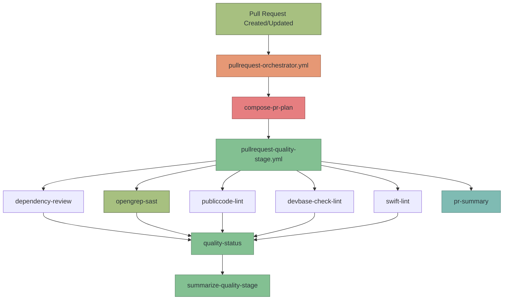
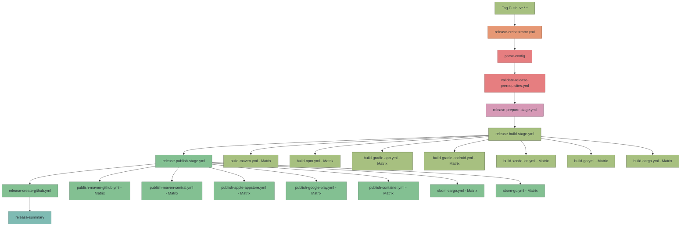
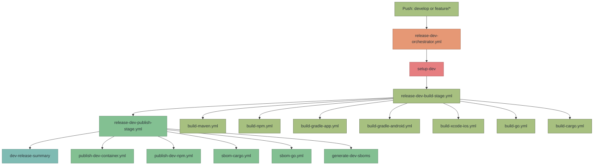
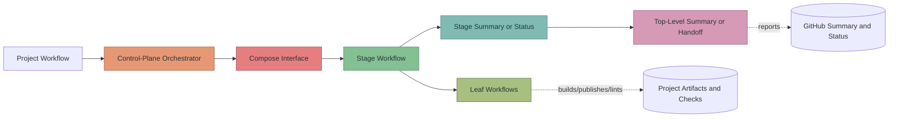

<!--
SPDX-FileCopyrightText: 2025 Digg - Agency for Digital Government

SPDX-License-Identifier: CC0-1.0
-->

# Workflow Architecture and Patterns

For workflow design rules and the planned long-term structure, see `docs/workflow-design-policy.md`.

## Pull Request Workflow Architecture

Primary high-level entry point: `pullrequest-orchestrator.yml`

The pull request flow follows the same control-plane pattern as release and dev:

1. `compose-pr-plan`
2. `execute-quality-stage`
3. `pr-summary`

The PR plan carries project/base-branch context, quality-policy flags, and the quality-stage target plan.
The quality stage owns lint/security fanout and produces one stage result contract.
The top-level summary job consumes the quality stage result and writes a GitHub Step Summary.


```mermaid
graph TD
    A[Pull Request Created/Updated] --> B[pullrequest-orchestrator.yml]
    B --> C[compose-pr-plan]
    C --> D[pullrequest-quality-stage.yml]

    D --> H[dependency-review]
    D --> I[opengrep-sast]
    D --> J[publiccode-lint]
    D --> K[devbase-check-lint]
    D --> L[swift-lint]
    H --> M[quality-status]
    I --> M
    J --> M
    K --> M
    L --> M
    M --> N[summarize-quality-stage]
    D --> O[pr-summary]

    style A fill:#a7c080,stroke:#5c6a4a,color:#2b3339
    style B fill:#e69875,stroke:#9d5c41,color:#2b3339
    style C fill:#e67e80,stroke:#9d4f50,color:#2b3339
    style D fill:#83c092,stroke:#5c856a,color:#2b3339
    style I fill:#a7c080,stroke:#5c6a4a,color:#2b3339
    style M fill:#83c092,stroke:#5c856a,color:#2b3339
    style N fill:#83c092,stroke:#5c856a,color:#2b3339
    style O fill:#7fbbb3,stroke:#5a8a82,color:#2b3339
```

### PR Stage Responsibilities

- `pullrequest-orchestrator.yml` owns PR order, plan handoff, and top-level summary
- `pullrequest-quality-stage.yml` owns quality check fanout and quality-stage result normalization
- leaf `lint-*` and `security-*` workflows stay focused on one check each

### PR Plan Contract

The PR orchestrator produces typed JSON payloads that drive the quality stage:

**`pr-plan-json`** — runtime context, policy, and stage plans:

| Field | Source | Purpose |
|-------|--------|---------|
| `context.project_type` | `inputs.project-type` | Project ecosystem (maven, npm, gradle, gradle-android, xcode-ios, cargo, go; python is reserved) |
| `context.base_branch` | `inputs.base-branch` or PR target | Base branch for commit linting |
| `context.reusable_ci_binary_ref` | `inputs.reusable-ci-binary-ref` | `reusable-ci` binary revision used by plain-runner jobs |
| `context.sast_opengrep_rules` | SAST input | OpenGrep rule selection |
| `context.sast_opengrep_fail_on_severity` | SAST input | OpenGrep failure threshold |

**`quality-stage-plan-json`** — quality check target plan:

| Target | Default | Purpose |
|--------|---------|---------|
| `targets.nanolinter.runs` | `true` | Run nanolinter — default lint surface (consumer's `just lint` via mise-installed nanolinter) |
| `targets.devbase_check.runs` | `false` | Run devbase-check — legacy alternative to nanolinter |
| `targets.dependency_review.runs` | `true` | Enable dependency vulnerability review |
| `targets.sast_opengrep.runs` | `true` | Enable OpenGrep SAST |
| `targets.public_code_lint.runs` | `false` | Enable publiccode.yml linting |
| `targets.swift.runs` | derived | `true` if either Swift linter is enabled |

### Stage Result Contract

Stage workflows use `reusable-ci summary stage-result` to turn a typed stage
plan plus explicit `target=result` pairs into normalized outputs:

```json
{
  "version": 1,
  "stage": "build|dev-build|prepare|publish|dev-publish|pr-quality",
  "result": "success|failure|cancelled",
  "ran": true,
  "targets": {
    "target_name": "success|failure|cancelled|skipped"
  }
}
```

Targets whose stage-plan `runs` flag is `false` are rendered as `"skipped"`.
Targets whose `runs` flag is `true` must provide an explicit result of
`success`, `failure`, or `cancelled`; unknown values and `skipped` for planned
targets are rejected so policy mistakes cannot become a successful stage. The
stage `result` is `"failure"` if any running target failed, `"cancelled"` if
any was cancelled and none failed, otherwise `"success"`. When no targets ran,
the stage result is `"skipped"`. Summary commands validate non-empty
`result-json` values and reject unsupported versions or malformed target
results instead of treating broken JSON as a clean skip.

### Artifact Transfer Contract

Release creation and dev SBOM aggregation use `artifact-transfer-plan-json` to
download exact CI artifact names instead of wildcard patterns. The contract is
versioned independently from release/dev plans:

```json
{
  "version": 1,
  "items": [
    {
      "kind": "build_artifact|build_sbom|analyzed_container_sbom|extracted_binaries",
      "name": "app-build-artifacts",
      "path": "./release-artifacts/",
      "required": true
    }
  ]
}
```

An item must set exactly one of `name` or `name_template`. The only template
placeholder is `{run_id}`, used for per-run analyzed-container SBOM uploads.

### Release Workflow Architecture

Primary high-level entry point: `release-orchestrator.yml`

The workflows shown underneath are mostly helper workflows used by the orchestrator, but several can still be used directly by advanced consumers when finer control is needed.

The current production release flow is intentionally stage-based:

1. `parse-config`
2. `validate-prerequisites`
3. `execute-prepare-stage`
4. `execute-build-stage`
5. `execute-publish-stage`
6. `create-release`
7. `release-summary`

The public orchestrator now acts as the release control plane. Build and publish fanout live one layer lower in stage-level reusable workflows.
Release preparation now follows the same pattern through `release-prepare-stage.yml`.


```mermaid
graph TD
    A[Tag Push: v*.*.* ] --> B[release-orchestrator.yml]
    B --> C[parse-config]
    C --> D[validate-release-prerequisites.yml]
    D --> E[release-prepare-stage.yml]
    E --> F[release-build-stage.yml]
    F --> G[release-publish-stage.yml]
    G --> H[release-create-github.yml]
    H --> I[release-summary]

    F --> J[build-maven.yml - Matrix]
    F --> K[build-npm.yml - Matrix]
    F --> L[build-gradle-app.yml - Matrix]
    F --> L2[build-gradle-android.yml - Matrix]
    F --> M[build-xcode-ios.yml - Matrix]
    F --> M2[build-go.yml - Matrix]
    F --> M3[build-cargo.yml - Matrix]

    G --> N[publish-maven-github.yml - Matrix]
    G --> O[publish-maven-central.yml - Matrix]
    G --> P[publish-apple-appstore.yml - Matrix]
    G --> Q[publish-google-play.yml - Matrix]
    G --> R[publish-container.yml - Matrix]
    G --> S[sbom-cargo.yml - Matrix]
    G --> T[sbom-go.yml - Matrix]

    style A fill:#a7c080,stroke:#5c6a4a,color:#2b3339
    style B fill:#e69875,stroke:#9d5c41,color:#2b3339
    style C fill:#e67e80,stroke:#9d4f50,color:#2b3339
    style D fill:#e67e80,stroke:#9d4f50,color:#2b3339
    style E fill:#d699b6,stroke:#93647c,color:#2b3339
    style F fill:#a7c080,stroke:#5c6a4a,color:#2b3339
    style G fill:#83c092,stroke:#5c856a,color:#2b3339
    style H fill:#83c092,stroke:#5c856a,color:#2b3339
    style I fill:#7fbbb3,stroke:#5a8a82,color:#2b3339
    style J fill:#a7c080,stroke:#5c6a4a,color:#2b3339
    style K fill:#a7c080,stroke:#5c6a4a,color:#2b3339
    style L fill:#a7c080,stroke:#5c6a4a,color:#2b3339
    style L2 fill:#a7c080,stroke:#5c6a4a,color:#2b3339
    style M fill:#a7c080,stroke:#5c6a4a,color:#2b3339
    style M2 fill:#a7c080,stroke:#5c6a4a,color:#2b3339
    style M3 fill:#a7c080,stroke:#5c6a4a,color:#2b3339
    style N fill:#83c092,stroke:#5c856a,color:#2b3339
    style O fill:#83c092,stroke:#5c856a,color:#2b3339
    style P fill:#83c092,stroke:#5c856a,color:#2b3339
    style Q fill:#83c092,stroke:#5c856a,color:#2b3339
    style R fill:#83c092,stroke:#5c856a,color:#2b3339
    style S fill:#83c092,stroke:#5c856a,color:#2b3339
    style T fill:#83c092,stroke:#5c856a,color:#2b3339
```

### Release Stage Responsibilities

- `release-orchestrator.yml` owns release order, policy handoff, and top-level stage readability
- `release-prepare-stage.yml` owns version-bump fanout and prepare-stage result normalization
- `release-build-stage.yml` owns build fanout and build-stage result normalization
- `release-publish-stage.yml` owns publish fanout and publish-stage result normalization
- leaf `build-*` and `publish-*` workflows stay focused on one ecosystem or destination each

Build artifact upload names are part of the typed plan contract. Maven, NPM, and
Gradle matrix builds upload `<artifact-name>-build-artifacts` and
`<artifact-name>-build-sbom`; Go artifact-first builds upload
`<artifact-name>-go-build-artifacts` and `<artifact-name>-go-build-sbom`.
Publish/container/release jobs consume the plan-provided names instead of
reconstructing ecosystem defaults in workflow YAML.

### Dev Release Workflow Architecture

Primary high-level entry point: `release-dev-orchestrator.yml`

The dev release flow now follows the same lighter control-plane pattern:

1. `setup-dev`
2. `execute-dev-build-stage`
3. `execute-dev-publish-stage`
4. `dev-release-summary`

Unlike the production flow, the dev path intentionally skips release creation, signing, and the broader prerequisite/policy layer. SBOM generation defaults to `none` for speed, but can be enabled with the dev orchestrator `sboms` input for wiring tests.
It still benefits from one small control-plane interface job so later stage calls depend on `dev-release-plan-json`, `dev-build-stage-plan-json`, and `dev-publish-stage-plan-json` instead of shell-derived context bags.
The dev publish stage plan includes explicit singleton `inputs` for non-matrix jobs such as NPM publish, Cargo SBOM, and Go SBOM, so workflow YAML does not need to index into plan arrays.
Those singleton inputs include the exact NPM build artifact upload name used by the dev build stage.
The dev publish stage also exposes a compact artifact payload so the top-level workflow does not need to wire separate container and NPM leaf outputs directly.

**Idempotent NPM publishing:** Dev versions are content-addressed (`{base}-dev-{branch}-{sha}`), so the same commit always produces the same version string. The `publish-dev-npm.yml` workflow checks the registry before publishing and skips with a warning if the version already exists. This makes re-runs safe — the pipeline succeeds without attempting to overwrite an immutable package.


```mermaid
graph TD
    A[Push: develop or feature/*] --> B[release-dev-orchestrator.yml]
    B --> C[setup-dev]
    C --> D[release-dev-build-stage.yml]
    D --> E[release-dev-publish-stage.yml]
    E --> F[dev-release-summary]

    D --> G[build-maven.yml]
    D --> H[build-npm.yml]
    D --> I[build-gradle-app.yml]
    D --> I2[build-gradle-android.yml]
    D --> I3[build-xcode-ios.yml]
    D --> I4[build-go.yml]
    D --> I5[build-cargo.yml]

    E --> J[publish-dev-container.yml]
    E --> K[publish-dev-npm.yml]
    E --> L[sbom-cargo.yml]
    E --> L2[sbom-go.yml]
    E --> M[generate-dev-sboms]

    style A fill:#a7c080,stroke:#5c6a4a,color:#2b3339
    style B fill:#e69875,stroke:#9d5c41,color:#2b3339
    style C fill:#e67e80,stroke:#9d4f50,color:#2b3339
    style D fill:#a7c080,stroke:#5c6a4a,color:#2b3339
    style E fill:#83c092,stroke:#5c856a,color:#2b3339
    style F fill:#7fbbb3,stroke:#5a8a82,color:#2b3339
    style G fill:#a7c080,stroke:#5c6a4a,color:#2b3339
    style H fill:#a7c080,stroke:#5c6a4a,color:#2b3339
    style I fill:#a7c080,stroke:#5c6a4a,color:#2b3339
    style I2 fill:#a7c080,stroke:#5c6a4a,color:#2b3339
    style I3 fill:#a7c080,stroke:#5c6a4a,color:#2b3339
    style I4 fill:#a7c080,stroke:#5c6a4a,color:#2b3339
    style I5 fill:#a7c080,stroke:#5c6a4a,color:#2b3339
    style J fill:#83c092,stroke:#5c856a,color:#2b3339
    style K fill:#83c092,stroke:#5c856a,color:#2b3339
    style L fill:#83c092,stroke:#5c856a,color:#2b3339
    style L2 fill:#83c092,stroke:#5c856a,color:#2b3339
    style M fill:#83c092,stroke:#5c856a,color:#2b3339
```

### Component Interaction Flow


```mermaid
graph LR
    A[Project Workflow] --> B[Control-Plane Orchestrator]
    B --> C[Compose Interface]
    C --> D[Stage Workflow]
    D --> E[Leaf Workflows]
    D --> F[Stage Summary or Status]
    F --> G[Top-Level Summary or Handoff]

    E -.builds/publishes/lints.-> H[(Project Artifacts and Checks)]
    G -.reports.-> I[(GitHub Summary and Status)]

    style B fill:#e69875,stroke:#9d5c41,color:#2b3339
    style C fill:#e67e80,stroke:#9d4f50,color:#2b3339
    style D fill:#83c092,stroke:#5c856a,color:#2b3339
    style E fill:#a7c080,stroke:#5c6a4a,color:#2b3339
    style F fill:#7fbbb3,stroke:#5a8a82,color:#2b3339
    style G fill:#d699b6,stroke:#93647c,color:#2b3339
```

### Workflow Execution Patterns

#### Pattern 1: Maven Library


```mermaid
graph LR
    A[Tag Push] --> B[parse-config]
    B --> C[validate-prerequisites]
    C --> D[execute-prepare-stage]
    D --> E[execute-build-stage]
    E --> F[execute-publish-stage]
    F --> G[create-release]

    style A fill:#a7c080,stroke:#5c6a4a,color:#2b3339
    style B fill:#e67e80,stroke:#9d4f50,color:#2b3339
    style C fill:#e67e80,stroke:#9d4f50,color:#2b3339
    style D fill:#d699b6,stroke:#93647c,color:#2b3339
    style E fill:#a7c080,stroke:#5c6a4a,color:#2b3339
    style F fill:#83c092,stroke:#5c856a,color:#2b3339
    style G fill:#d699b6,stroke:#93647c,color:#2b3339
```

#### Pattern 2: Maven/NPM Application with Container


```mermaid
graph LR
    A[Tag Push] --> B[parse-config]
    B --> C[validate-prerequisites]
    C --> D[execute-prepare-stage]
    D --> E[execute-build-stage]
    E --> F[execute-publish-stage]
    F --> G[create-release]

    style A fill:#a7c080,stroke:#5c6a4a,color:#2b3339
    style B fill:#e67e80,stroke:#9d4f50,color:#2b3339
    style C fill:#e67e80,stroke:#9d4f50,color:#2b3339
    style D fill:#d699b6,stroke:#93647c,color:#2b3339
    style E fill:#a7c080,stroke:#5c6a4a,color:#2b3339
    style F fill:#83c092,stroke:#5c856a,color:#2b3339
    style G fill:#d699b6,stroke:#93647c,color:#2b3339
```

#### Pattern 3: Multi-Registry Publishing


```mermaid
graph LR
    A[Tag Push] --> B[parse-config]
    B --> C[validate-prerequisites]
    C --> D[execute-prepare-stage]
    D --> E[execute-build-stage]
    E --> F[execute-publish-stage]
    F --> G[create-release]

    style A fill:#a7c080,stroke:#5c6a4a,color:#2b3339
    style B fill:#e67e80,stroke:#9d4f50,color:#2b3339
    style C fill:#e67e80,stroke:#9d4f50,color:#2b3339
    style D fill:#d699b6,stroke:#93647c,color:#2b3339
    style E fill:#a7c080,stroke:#5c6a4a,color:#2b3339
    style F fill:#83c092,stroke:#5c856a,color:#2b3339
    style G fill:#d699b6,stroke:#93647c,color:#2b3339
```

---
